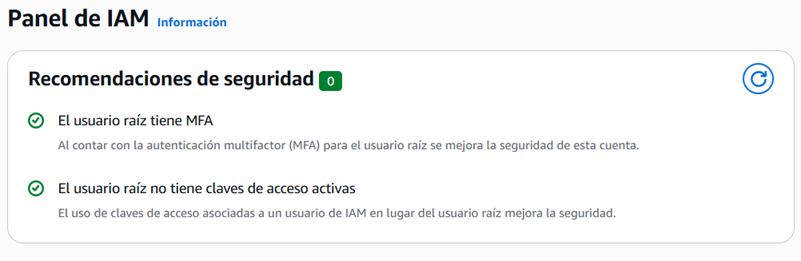
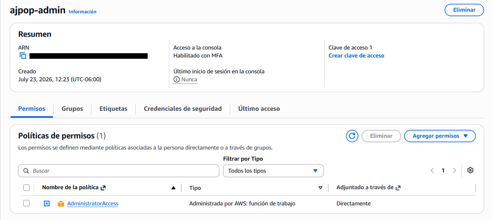
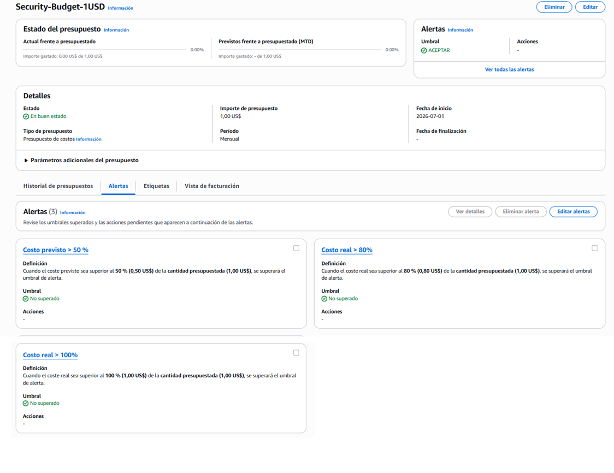

# 🛡️ Module 01: AWS Fundamentals, Security & FinOps

This module documents the initial foundational setups required to secure an AWS account, enforce the **Principle of Least Privilege**, and establish proactive **FinOps (Cost Governance)** controls from day zero.

---

## 💡 Key Theoretical Concepts

### 1. IAM & Security Governance
* **Principle of Least Privilege:** Granting only the exact permissions required for a task. Always avoid using the Root Account for daily operations.
* **Policy Evaluation Logic:** AWS evaluates policies with an explicit "Deny-by-default" approach. An explicit `"Deny"` statement overrides any `"Allow"` statement regardless of context.
* **IAM Roles over Static Keys:** Assigning IAM Roles directly to services (e.g., EC2 accessing S3) prevents hardcoding permanent access keys into applications.

### 2. Proactive Cost Management (FinOps)
Setting up **AWS Budgets** with forecasted thresholds allows team leads to make operational adjustments *before* incurring unexpected expenses.

---

## 📸 Lab Implementations & Evidence

### 1. 🔐 Root Account MFA Hardening
Enabled Multi-Factor Authentication (MFA) on the root account to prevent unauthorized access to the account owner identity.

---

### 2. 👤 IAM Administrator Setup
Created an administrator user (`ajpop-admin`) assigned with the `AdministratorAccess` managed policy for daily management tasks, isolating the root account.

---

### 3. 💳 FinOps & Cost Governance (AWS Budgets)
Configured an **AWS Budget of $1.00 USD** with a 3-tier alert strategy:
* ⚠️ **80% ($0.80 USD):** Actual spend alert threshold.
* 🚨 **100% ($1.00 USD):** Actual spend limit alert.
* 🔮 **50% Forecasted ($0.50 USD):** Early warning alert driven by machine learning to catch cost anomalies early.

