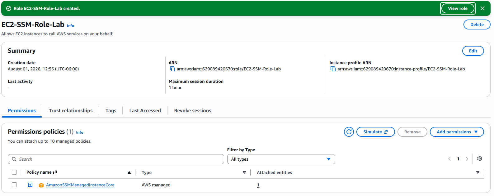
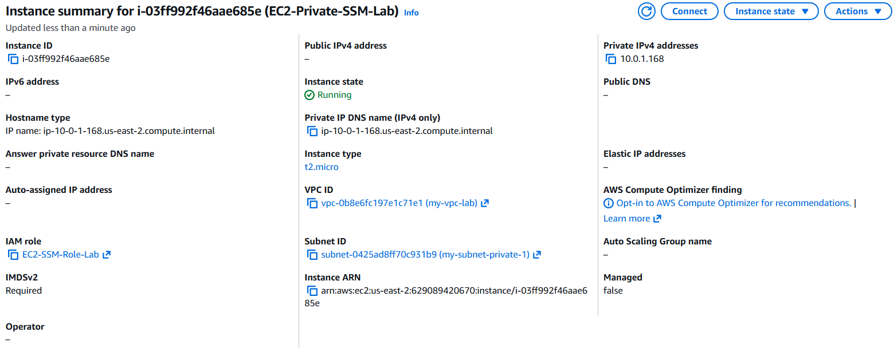
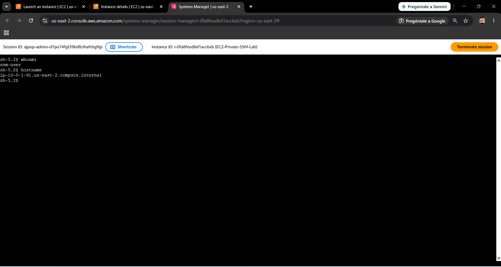
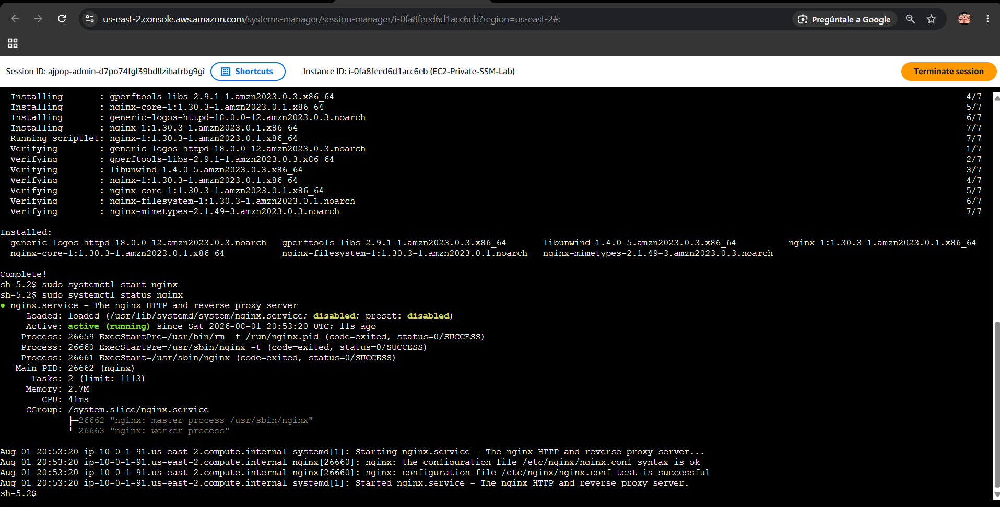

# ⚡ Module 03.1: Amazon EC2 Core & SSM Zero-Trust Access

This module documents the core compute architecture on AWS, evaluating cost trade-offs across purchasing models and implementing a **Zero-Trust strategy** for instance administration using **AWS Systems Manager (SSM) Session Manager**.

---

## 💡 Key Theoretical Concepts

### 1. EC2 Instance Families & Workload Matching
* **General Purpose (`t3`, `m5`):** Balanced compute, memory, and networking. Ideal for general-purpose web servers and dev environments.
* **Compute Optimized (`c5`, `c6g`):** High vCPU-to-RAM ratio. Tailored for high-performance processing, batch analytics, and media encoding.
* **Memory Optimized (`r5`, `x2gd`):** High RAM-to-vCPU ratio. Required for in-memory databases (Redis, Memcached) and real-time processing.
* **Storage Optimized (`i3`, `d3`):** High sequential I/O and low latency. Designed for NoSQL databases and massive data logging.

### 2. Purchasing Options & Financial Trade-Offs
* **On-Demand:** Maximum flexibility, pay-by-the-second with no long-term commitment. Highest cost per hour.
* **Savings Plans & Reserved Instances (RIs):** Up to 72% discount in exchange for a 1 or 3-year commitment. *Savings Plans* offer maximum flexibility across families/regions, whereas *Zonal RIs* reserve physical hardware capacity.
* **Spot Instances:** Unused EC2 capacity with up to 90% discount. Ideal for stateless, fault-tolerant workloads (can be terminated by AWS with a 2-minute warning).

### 3. Modern Zero-Trust Access Model
Traditional SSH access requires exposing Port 22 and managing static `.pem` key pairs. By leveraging **AWS SSM Session Manager**, instances communicate via outbound HTTPS (Port 443) using an **IAM Role** (`AmazonSSMManagedInstanceCore`).
* **Zero Public Exposure:** No public IPs required and inbound security group rules remain completely empty (`0` open ports).
* **Identity-Driven & Audited:** Access is governed via IAM, and command logs can be recorded directly in Amazon CloudWatch or S3.

---

## 📸 Lab Implementations & Evidence

### 1. 🛡️ IAM Role Provisioning for Systems Manager
Created an IAM Role (`EC2-SSM-Role-Lab`) with the `AmazonSSMManagedInstanceCore` managed policy, enabling the EC2 instance agent to communicate securely with SSM without static credentials.

---

### 2. 🖥️ Isolated Private EC2 Deployment
Deployed an EC2 instance (`EC2-Private-SSM-Lab`) using Amazon Linux 2023 within our VPC network. Key security configurations enforced:
* **No Key Pair:** SSH key pair was explicitly disabled.
* **No Inbound Rules:** Security Group (`sg-ec2-private-ssm`) configured with zero inbound rules.
* **IAM Instance Profile:** Attached the `EC2-SSM-Role-Lab` role.

---

### 3. 🔐 Terminal Session via SSM Session Manager
Established a secure terminal connection directly from the AWS Console using Session Manager without opening Port 22 or using a public IP. Verified identity inside the instance.

---

### 4. 🌐 Web Server Deployment & PoC
Executed administrative commands inside the secure SSM session to install and verify the Nginx web server (`active (running)`).

